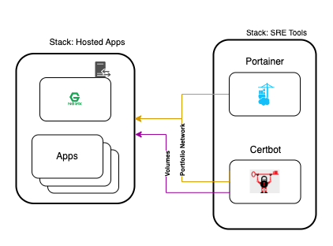

# Site Reliability Tools

Site reliability tools container Docker Compose files to be used within a Docker Swarm instance. To isolate management functions from application services, all tools are deploy within a separate stack from application services. 

## Table of Contents

* [Design](#design)
* [Folder Structure](#folder-structure)


### Design

<p align="center">
 
</p>

All applications a connected to via Portfolio Network and volumes to sychronize security, maintenance and observabiliy applications.

### Tools

#### Folder Stucture
```txt
app
|_ site-reliability-tools
    |_ logging
    |_ maintenance
    |_ observability
    |_ security
|_ ...
```

#### Security

Applications
* [Certbot (LetsEncrypt)](https://certbot.eff.org/)

Shared volumes connect services for information sharing. One of these volumes is for communicating to the host machine for application restart on certificate renewal.


#### Maintenance
Applications
* [Portainer](https://www.portainer.io/)

Shared volumes connect services for information sharing. Portainer provides visiablity into all Docker Swarm services.
